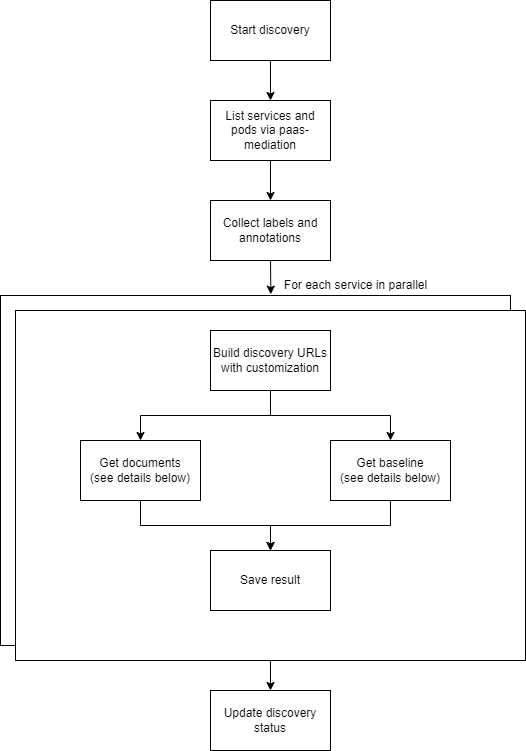
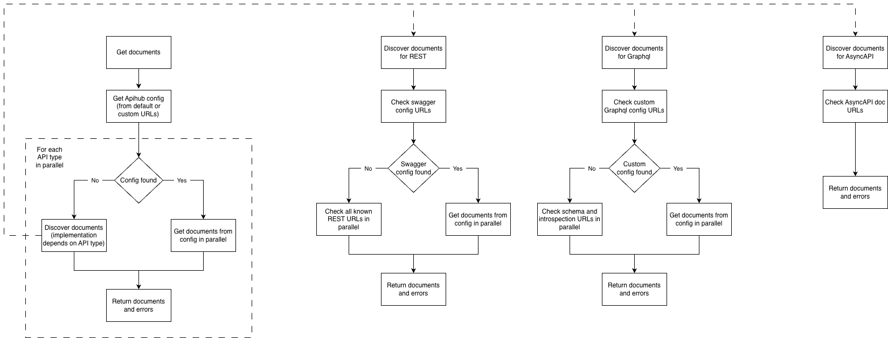

# How APIHUB Agent Discovery Works

The Agent is a k8s microservice that requires the Cluster View role. It allows the Agent to query REST endpoints in any service within any namespace.

Hint: Agent permissions can be limited to a particular namespace if needed by setting a custom role for it.

The API spec discovery process is initiated via API for a specific namespace.

The Agent retrieves a list of all services in the chosen namespace via the k8s API. After that, the Agent queries several REST endpoints for each service (in parallel) and attempts to download the OAS specification file.

## Contract Endpoints for Discovery

1. First, the Agent looks for Swagger configuration files. This is typically the case when a service provides several OAS files.

These are the default Swagger config URLs:

- `/v3/api-docs/swagger-config`
- `/swagger-resources`

2. If no config files are found, the Agent checks the default Swagger URLs for OAS files directly:

- `/q/openapi`
- `/v3/api-docs`
- `/v2/api-docs`
- `/v1/api-docs`
- `/api-docs`
- `/swagger-ui/swagger.json`

Notes:

- If both configuration files AND default URL contracts are present, only the contents of the configuration files will be discovered.
- Currently, only the JSON format of the API contract is available for the Agent’s discovery.
- APIHUB requests these paths during contract discovery. Therefore, there must be no prefix in the base path of the URLs above.  
  - Correct path: `https://<service name>.<namespace>:8080/v3/api-docs`  
  - Incorrect path: `https://<service name>.<namespace>:8080/<service prefix>/v3/api-docs`
- These endpoints must be available without any authentication.
