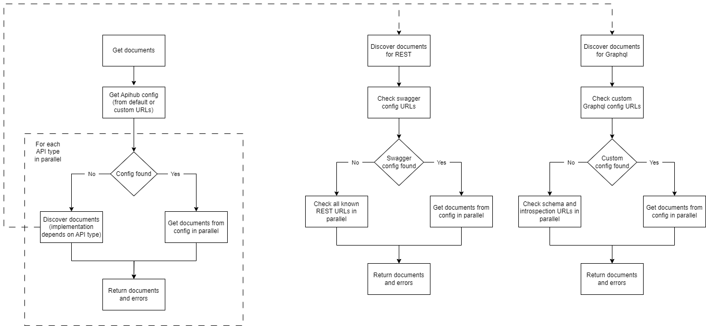

# How APIHUB Agent Discovery Works

The Agent is a k8s microservice that requires the Cluster View role. It allows the Agent to query REST endpoints in any service within any namespace.

Hint: Agent permissions can be limited to a particular namespace if needed by setting a custom role for it.

The API spec discovery process is initiated via API for a specific namespace.

The Agent retrieves a list of all services in the chosen namespace via the k8s API. After that, the Agent queries several REST endpoints for each service (in parallel) and attempts to download API specification files.


## Contract Endpoints for Discovery

All discovery URLs are configurable via `config.yaml`. The values below are the built-in defaults.

#### APIHUB Config

Initially, Agent checks for the presence of APIHUB config. If it doesn't detect one, it runs discovery for each supported API type.

Default APIHUB config URL:

- `/v3/api-docs/apihub-swagger-config`

See [apihub-config](./dev_docs/apihub-config.md) for details on the APIHUB config format.

#### OpenAPI

First, the Agent looks for Swagger configuration files. This is typically the case when a service provides several OAS files.

Default OpenAPI config URLs:

- `/v3/api-docs/swagger-config`
- `/swagger-resources`

If no config files are found, the Agent checks the default doc URLs for OAS files directly:

- `/q/openapi`
- `/v3/api-docs`
- `/v2/api-docs`
- `/swagger-ui/swagger.json`

#### GraphQL and AsyncAPI

GraphQL and AsyncAPI have no built-in default URLs — they must be configured or these API types can be
discovered via `apihub-config`.

### Discovery algorithm



**Notes:**
- If both configuration files AND default URL contracts are present, only the contents of the configuration files will be discovered.
- APIHUB requests configured paths during contract discovery. Therefore, there must be no prefix in the base path of the URLs above.
    - Correct path: `https://<service name>.<namespace>:8080/v3/api-docs`
    - Incorrect path: `https://<service name>.<namespace>:8080/<service prefix>/v3/api-docs`
- These endpoints must be available without any authentication.

## Configuring Discovery URLs

All discovery URLs can be configured via `config.yaml`, see [`config.template.yaml`](../qubership-apihub-agent/config.template.yaml) for a full example with all available configuration options.

The YAML config structure for discovery URLs:

```yaml
discovery:
  urls:
    openapi:
      config-urls:
        - /v3/api-docs/swagger-config
      doc-urls:
        - /v3/api-docs
    graphql:
      config-urls:
        - /api/graphql-server/schema/domains
      doc-urls:
        - /api/graphql-server/schema
    apihub-config:
      config-urls:
        - /v3/api-docs/apihub-swagger-config
    asyncapi:
      doc-urls:
        - /v3/api-docs/asyncapi
```
